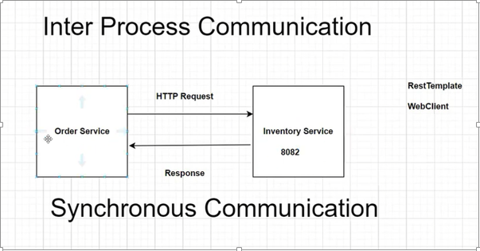
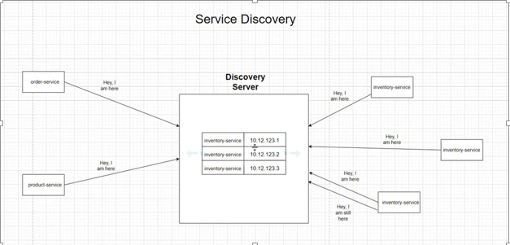
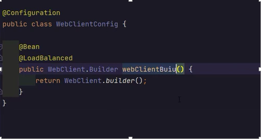
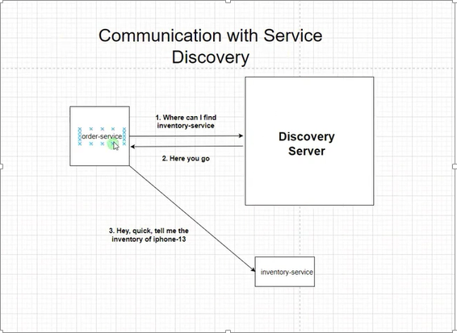
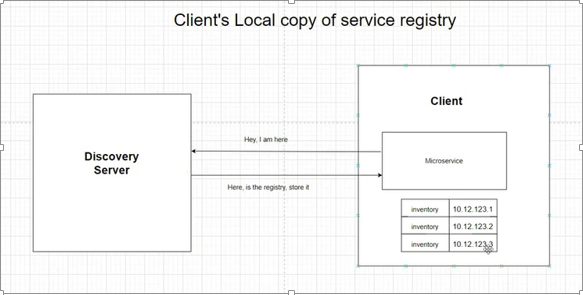
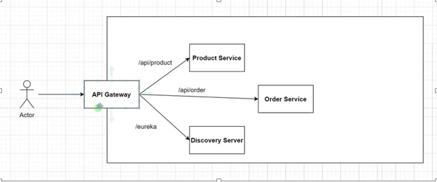
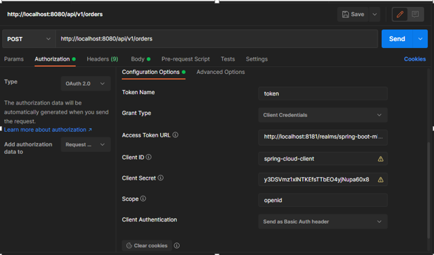
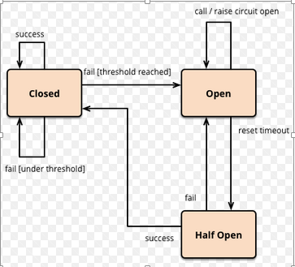
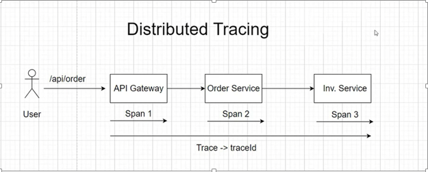
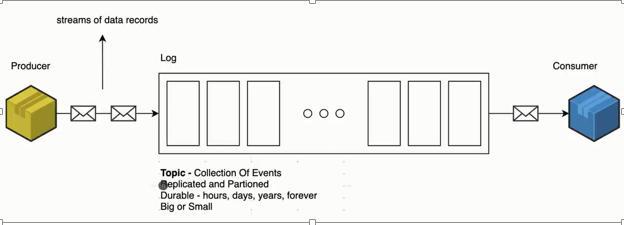

# Online Ordering System - Microservice 

This is a simple online shopping application develop for the practices spring boot microservice architecture and related technologies. Basically hope to cover these pints through this project.

-	Service discovery and load balancing 
-	Distributed tracing
-	API secure using OAuth2 and keycloak 
-	Implement circuit barker
-	Event driven architecture and Kafka implementation 

For this we used Spring Cloud project (spring cloud is a project like spring framework. It help to build reliable microservice. For that provide common set of design patterns like circuit barker, configuration management).

## Description 


##	Main services 
1.	Product Service
2.	Order Service
3.	Inventory Service
4.	Notification Service

### 1. Product Service

This service used to create and view product details. And also use MongoDB as a database.
For this service there is integration test cases wrote using “testcontainers” library and MongoDB docker container. 
MockMVC used to create a request from integration test to controller API endpints.

__“Testcontainers is a Java library that supports JUnit tests, providing lightweight, throwaway instances of common databases, Selenium web browsers, or anything else that can run in a Docker container.”__

### 2. Order Service

This service is used for the place order. It used MYSQL database.
This service will communicate with inventory service through Sync communication. 
To communicate between microservices 
And also this will async communicate with notification service.
Basically it used Kafka as a quae service. (RabbitMQ)
For the microservice communication we can used Rest Template or WebClients, in this project used WebClient to communicate. 
Reason for that WebClient has modern API support for sync, async communications and streaming scenarios. 



### 3.	Inventory service
Inventory service main responsibility is maintain inventory. It used MYSQL database.
Basically when the application start I used @Bean method to create inventory using hardcoded values. 


### 4.	Notification service
In this project this service act like a consumer in Kafka service. After place order, order service send a message to notification service through the Kafka. We can send those messages to customer email in this servise.

## Service Discovery (spring cloud Netflix Eureka service)
The Service Discovery mechanism helps us know where each instance is located. In this way, a Service Discovery component acts as a registry in which the addresses of all instances are tracked.



This discovery pattern create server called discovery server it keep all information about services. “Name and IP”
When we use discovery server, microservices try when start the application it try to register all services. It will keep in the local copy in registry in discovery server.  
Using this we can avoid hardcoding IP address.
This is how this communication work through order and inventory services.
This will manage the load balancing also among the services. Using  __@loadbalance__





In here there is main two parts 
1.	Clients (Order service, product service and inventory service)
2.	Discovery server (Another microservice work as a discovery server)

Between client and discovery server,
Client also keep copy of details when discovery server down situation to work.



## API Gateway (spring cloud API gateway)



API gateway act like an entry point of this microservice. So all API request going through the API gateway. This use URL pattern to call deferent services. 

And it provide these additional things
1.	Load balancing 
2.	Routing based authentication
3.	SSL termination
4.	Security 

So authorization we used Oauth2 and keyclock server. (Keycloak is an open-source identity and access management tool with a focus on modern applications). when we used Keycloak no need to write function for user managements another staff we can used those facilities. 

Other famous API gateways APG, Kong API gateway 

### Keycloak
As mentioned keycloak server is used for the authenticated API requests.
For the first we created Realm for this microservice
Then under that realm we created client, that client belong client id and secret key.
Then we can use postman to generate token for each API requests.
Then we can enabled webfluxsecurity in API gateway and configured necessary details. 



## Circuit breaker (Resilienc4J )
This used when we need resilient communication with our services. 
We used order service to inventory service Sync communication. It will wait until respond is coming. If inventory service is down or had communication (performance issue slow) issue that are block our normal communication.
Other famous example is Netfix Hystric. 
Resilienc4J is a alternative for Netfix Hystric.
And spring boot actuator is used to Messer health matrix in Circuit breaker.



1.	Normally if there is no problem among the services the state is __“closed”__ (this is normal scenario). If it is closed communication is allowed among the services. 
2.	If service is down state is change in to __“open”__ state. Then it not allowed to call the communication to other service. During this time we can throw error mgs or call Fallback method. 
3.	After certain time “state” will change to __“half open”__ (we can declare that time). When it is happened it try to connect again services. If still not working that service it will again change state to __“open”__

## Distributed tracing (Zipkin)
This will help us to track request start to end. So if request fail any time we can easily understand the location and reason for that. We can see the logs also but when we used microservice architecture it is difficult to track the errors only using logs.
SpanID is the number of steps the request is take inside our system
TraceID is unique identifier the request come to the system. 
We can create our own span ID also inside the system. (show in order service impl file.)



## Event driven architecture (Kafka) 
 So after place order, orderService call async communication to notification service (not wait until response come) 
These kind of async communication can be enabled using event driven architecture. 
(An event-driven architecture uses events to trigger and communicate between decoupled services and is common in modern applications built with microservices.)

Apache Kafka is a distributed event store and stream-processing platform. It is an open-source system
In this scenario order service is the producer and notification service is the consumer.



- __Event Producer:__ They are responsible for detecting and generating Events.
- __Event Consumer:__ They consume the events generated by the Event Producer.
- __Event Channel:__ It is also called Event Bus. It helps to transfer events from the Event Generator to the Event Consumer.

##	Docker containerize full project. 
We can do it manually (docker build –t apigateway-dockerfile) or we can use JIB library (it build containers without using docker installation) and push to docker hub (to my account).
As a second step need to create docker file for each services.
For this project first created docker-compose.yml file with all services used to this microservice. 
Ex: MongoDB, MySQL, keycloak, Kafka etc.
After mentioned those services need to mentioned our containerized services also related to their depend other services. 

## API Reference

#### Get all items

```http
  POST  http://localhost:8080/api/v1/product
```

_{
	“name”:”Iphone14”,
	“description”:”Iphone14”,
	“price”:14000
}_

```http
GET => http://localhost:8080/api/v1/product
```

```http
GET => http://localhost:8080/api/v1/order
```

_{
    "orderLineItemsDtoList":[
        {
        "skuCode":"Iphone_12",
        "price": 11000,
        "quantity": 1
        }
    ]
}_

```http
GET => http://localhost:8080/api/v1/inventory?skuCode=Iphone_12&skuCode=Iphone_12_red
```

# Used Technologies.

- Spring Boot
- MongoDB
- MySQL
- Eureka server
- OAuth2 and Keycloak
- Zipkin server
- Zookeeper and Kafka 
- Resilience4j circuit breaker
- Docker 

# Getting Started
To install this example application, run the following commands:
```
git clone https://github.com/Gehan-Chandima-Rakwana/Online_Shoping_Microservice_Parent.git
```

# Run program.
Using docker 
Start Docker Container:
```
	Command: docker compose up
```

Stop Docker Container:
```
    Command: docker-compose down
```
